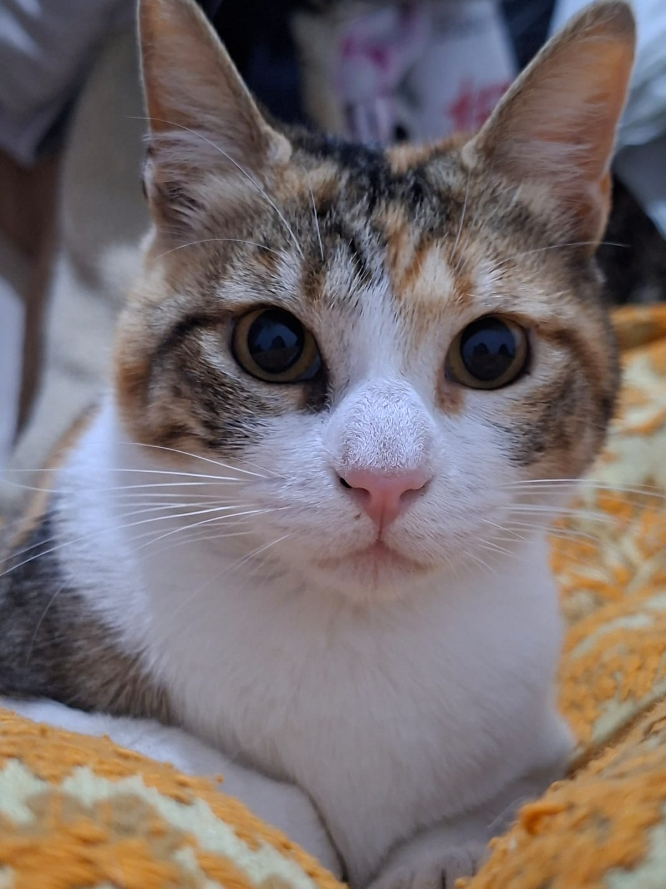

# Programación con objetos I
## Presentación Personal

### Jade González
- Mi nombre es Jade Noralis González
- Vivo en González Catan
- Tengo 22 años

Este es mi segundo contacto con github ya que la utilice en el cuatrimestre pasado con la materia "Taller de lenguajes de marcado y tecnologías web". Cuando empece la carrera honestamente no sabia mucho sobre programar pero gracias a la universidad de apoco voy agarrándole la mano cada vez mas y eso me emociona mucho.

### Un poco sobre mí

Me gusta mucho pasar tiempo con mis hermanas siempre están para apoyarme o hacer alguna locura conmigo, también adoro pasar tiempo con mis amistades de echo gracias a la universidad he conocido a personas increíbles.

Amo el mate, los momentos de tranquilidad, aunque de vez en cuando no esta mal alguna aventura. En mis ratos libres para mí, me gusta ver películas/series o leer un buen libro en compañía de mis mascotas.  

Mi gata se llama Nami por un personaje de One piece, considero que es una de mis animes favoritos y por eso me gusto la idea de su nombre.

